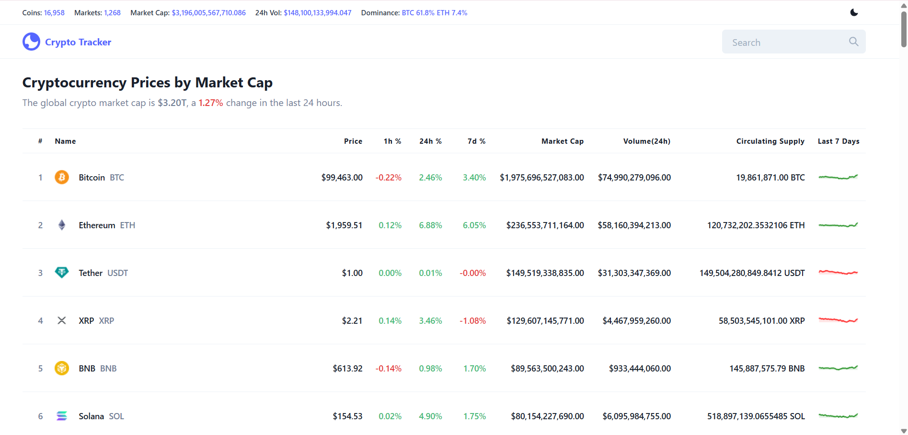

# Crypto Tracker - ReactJs


A Crypto Tracker project built with React, Redux, Chakra UI and CryptoApi. Get the cryptocurrency information with smart layout and pagination. Search through thousands of cryptocurrencies with autocomplete. View price, price chart, price change, market rank, market cap, trading volume and more.

### Live Demo
https://gentle-dusk-21922c.netlify.app/

### Screenshots





### Tools

- React (Hooks)
- Redux - Redux Toolkit
- Chakra UI
- Crypto Api

### Installation

```
git clone https://github.com/Sip-p/Tracker
npm install

npm start / npm run build
```

### Meta
Sip-p
